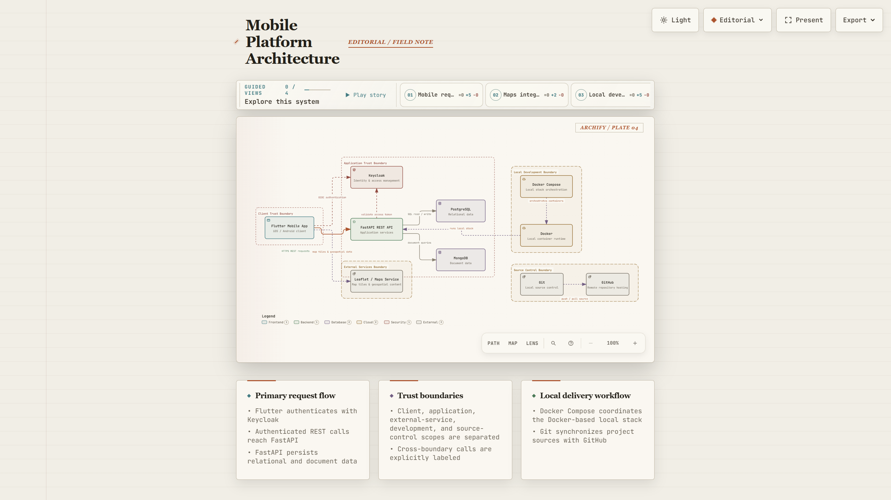
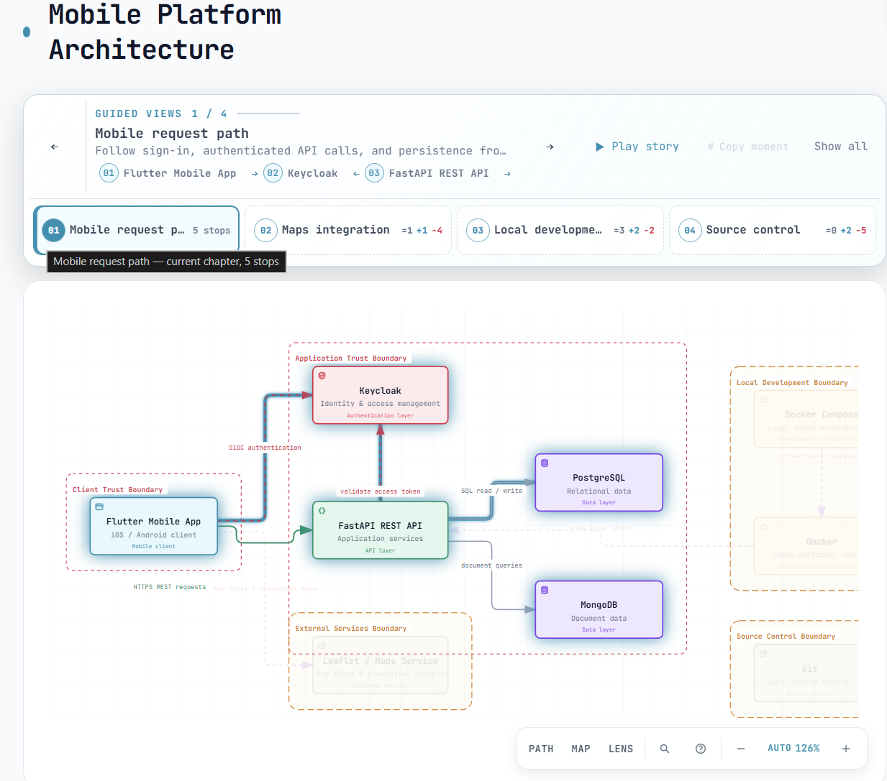
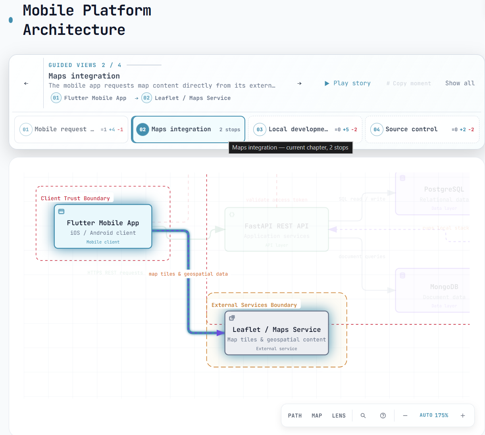
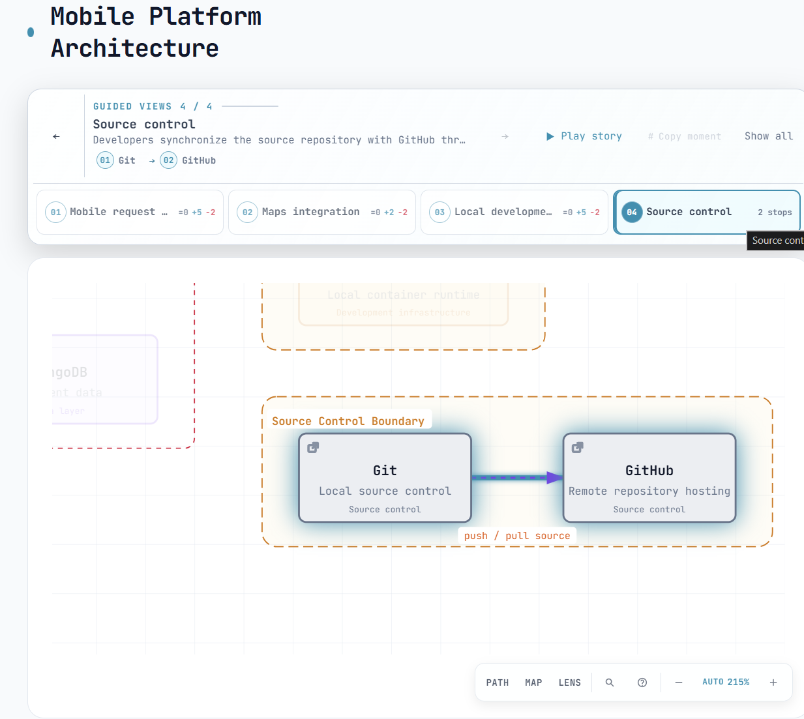
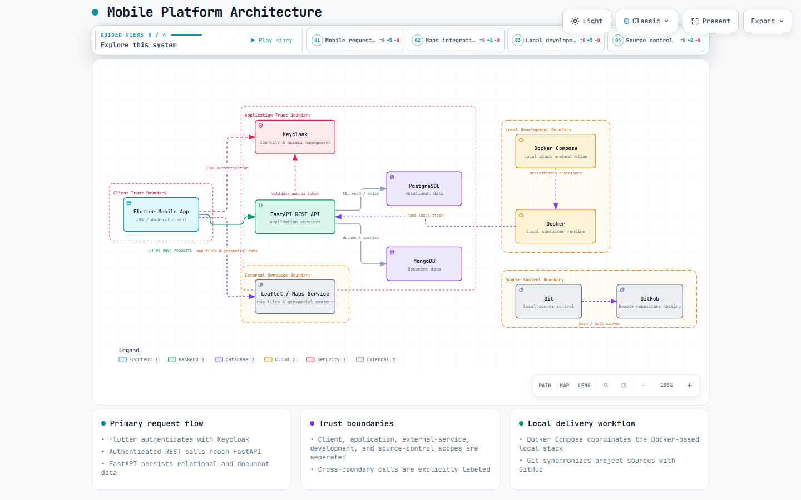
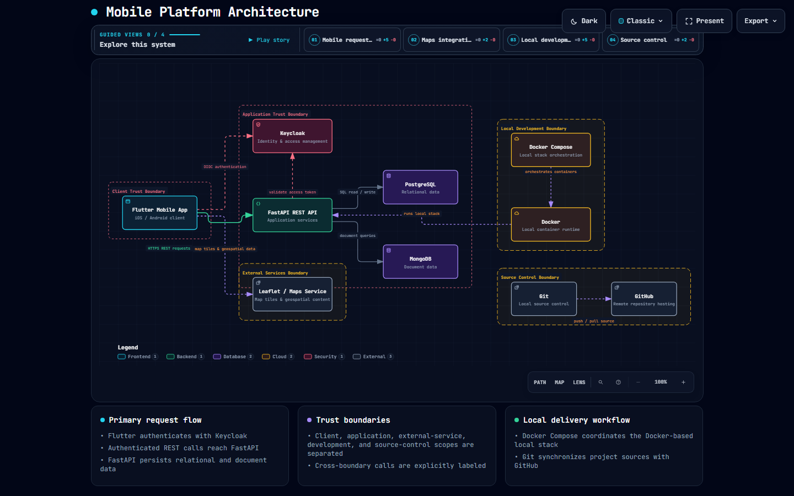
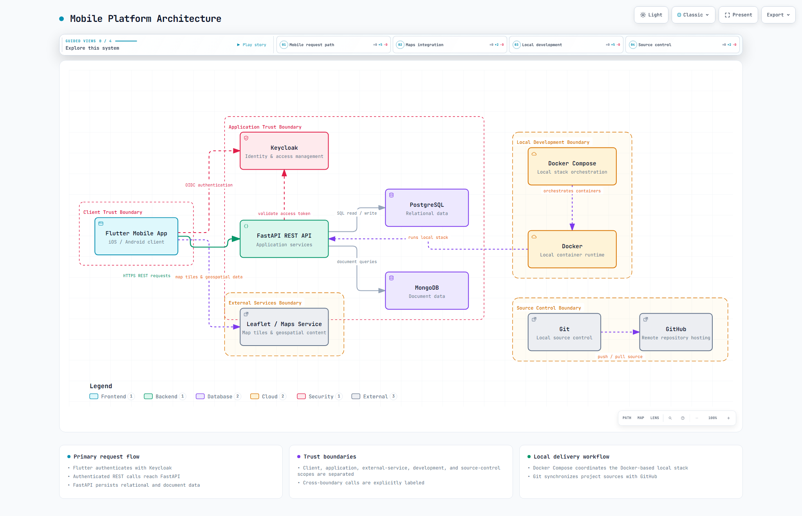
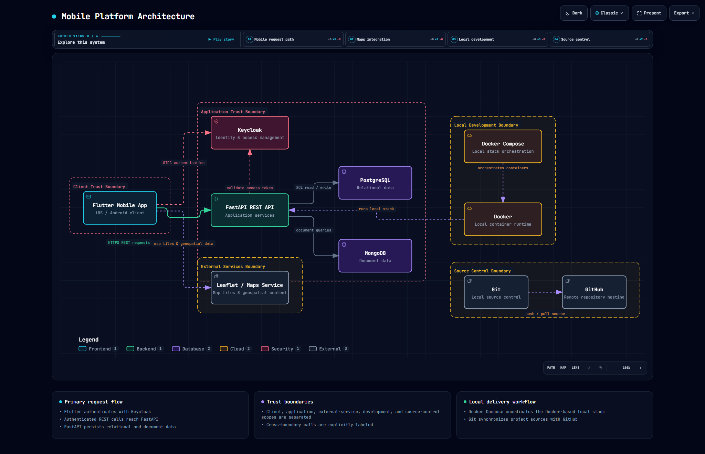

# Práctica 02: Boceto de Arquitectura con Archify

👉 **[Ver el diagrama de arquitectura interactivo en vivo (GitHub Pages)](https://F-Anks.github.io/Integradora_230758/Practica02/mobile-platform-architecture.html)**

## Descripción General
En esta práctica se llevó a cabo la instalación y configuración de **Archify** (un agente de modelado arquitectónico) mediante la interacción con **Codex de OpenAI**.

El resultado principal fue generar un diagrama de arquitectura interactivo en formato HTML que describe la estructura de una plataforma móvil. Este diagrama conceptualiza e ilustra distintas capas del sistema, incluyendo:
- Capa Móvil (Frontend y plataforma)
- Manejo de Autenticación
- Capa de API / Backend
- Capa de Datos (Almacenamiento)
- Servicios Externos integrados
- Infraestructura de Desarrollo y Despliegue

## Evidencias del Proceso (Capturas)
A continuación, se presentan imágenes documentando el proceso de la práctica:

## Pruebas Visuales Automatizadas (Visual Checks)
Archify generó además pruebas visuales de contención (*visual checks*) para asegurar que la vista del diagrama renderiza de manera correcta bajo distintos temas (claro/oscuro) y resoluciones:

### Resolución 1440x900
| Modo Claro | Modo Oscuro |
|:---:|:---:|
|  |  |

### Resolución Ultra-Ancha (2048x1320)
| Modo Claro | Modo Oscuro |
|:---:|:---:|
|  |  |

## Archivos Entregables Generados
Dentro de esta carpeta (`Practica02/`), se alojan los archivos que dan sustento a este trabajo:
- `mobile-platform-architecture.html`: Archivo principal interactivo con el diagrama renderizado.
- `mobile-platform-architecture.json`: Estructura base de datos y esquema del diagrama.
- `mobile-platform-architecture.visual-check.html`: Reporte visual automatizado.
- `mobile-platform-architecture.visual-check.json`: Metadata asociada a las capturas de revisión visual.
