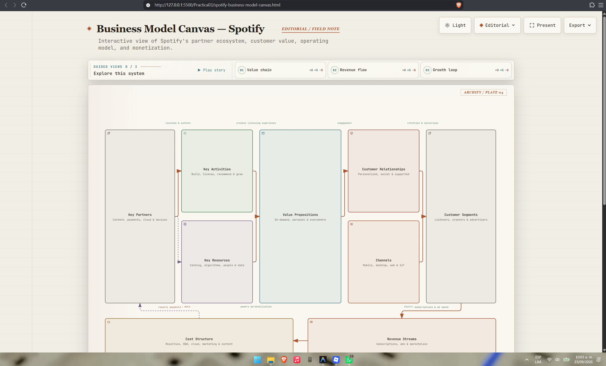
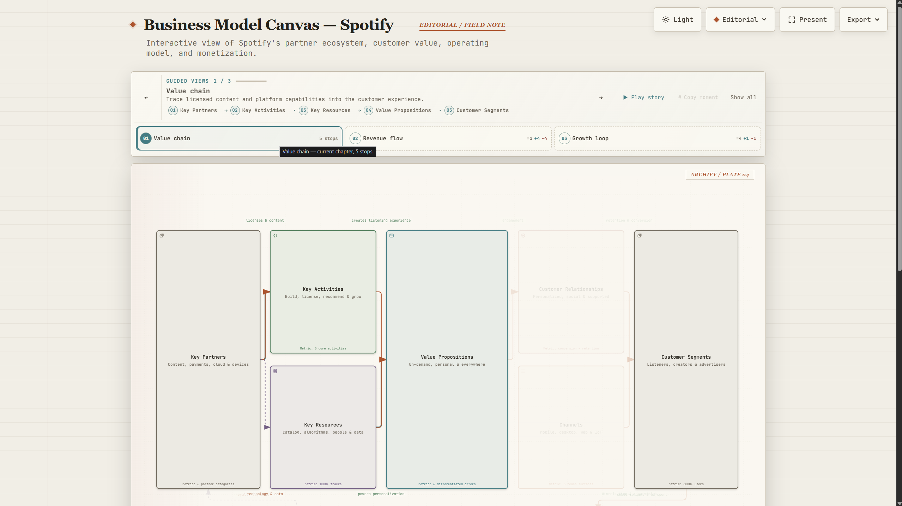
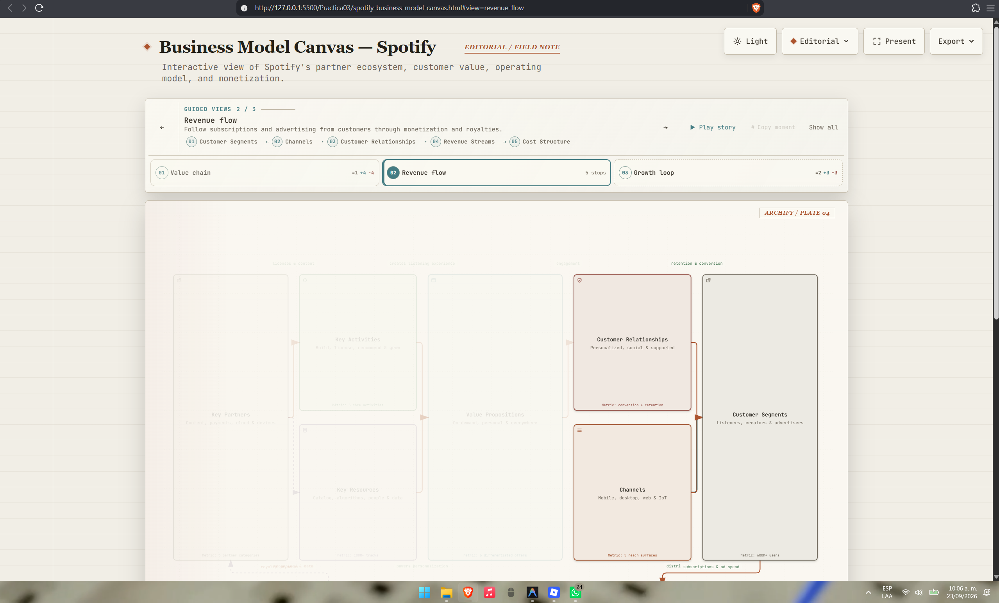
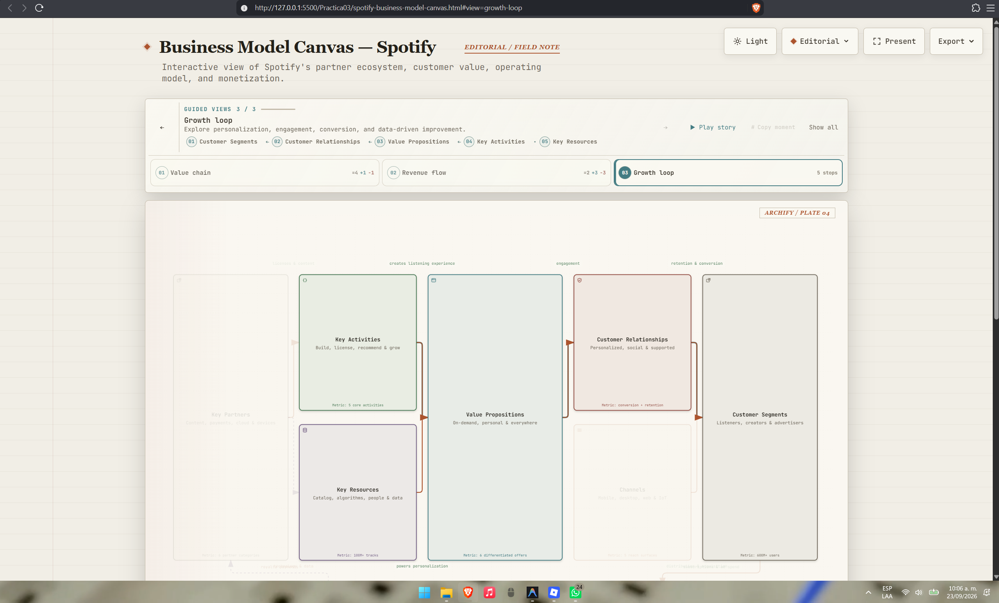
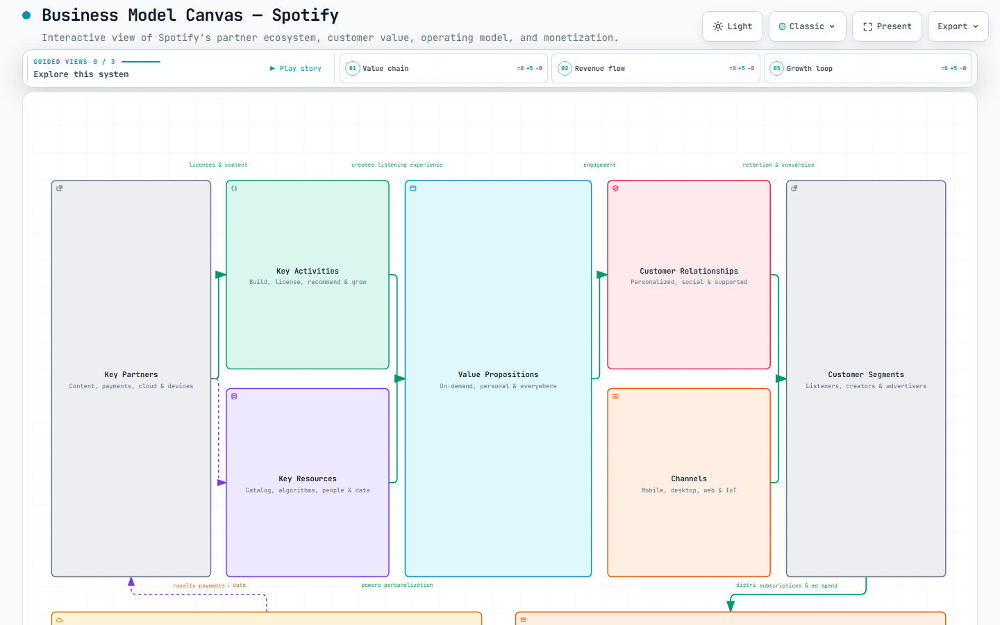
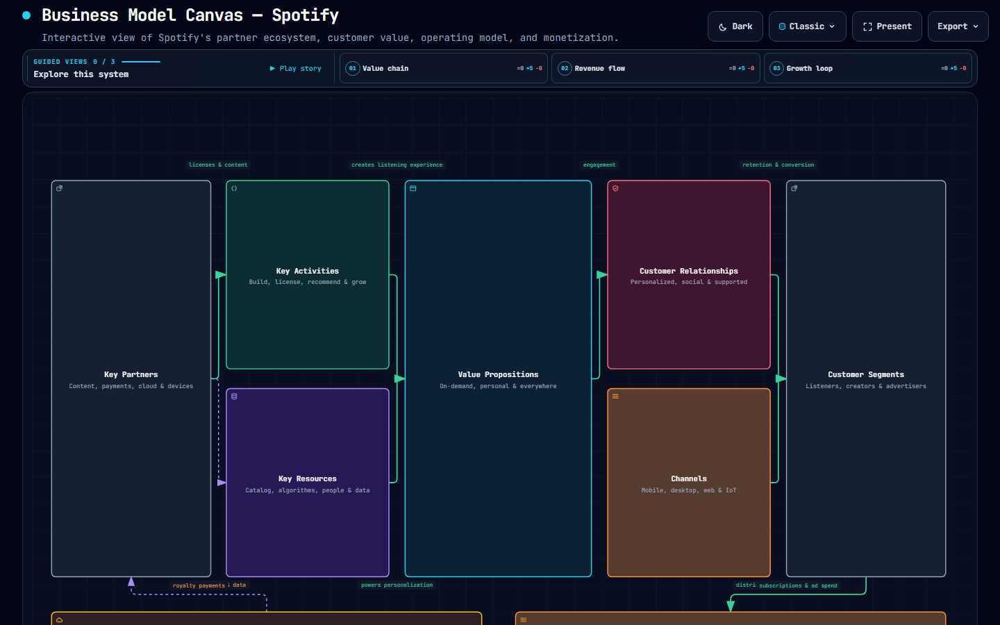
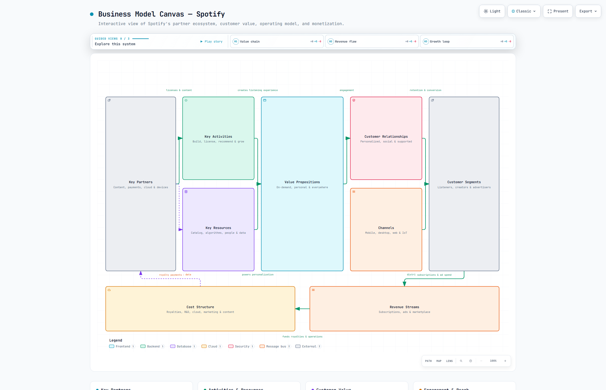
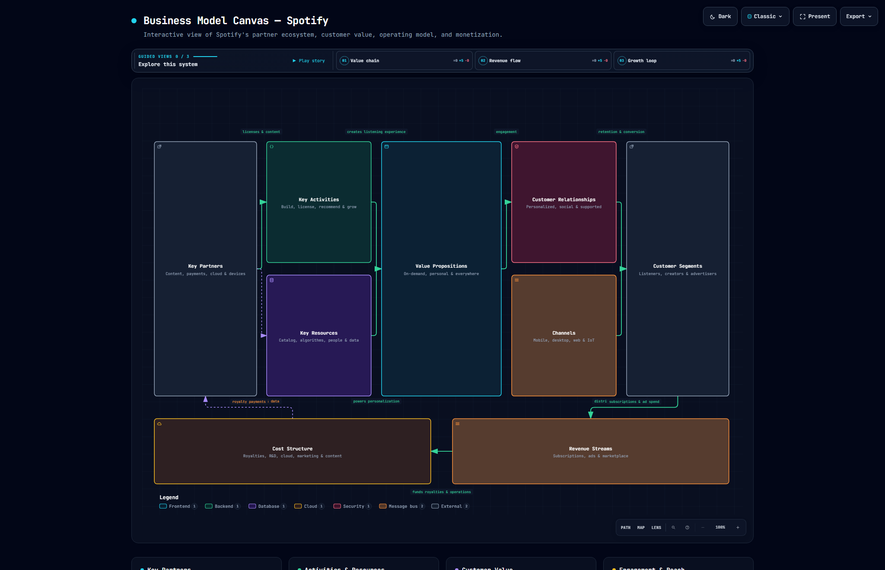

# Práctica 03: Boceto de Modelo Canvas con Archify

👉 **[Ver el diagrama de modelo canvas interactivo en vivo (GitHub Pages)](https://F-Anks.github.io/Integradora_230758/Practica03/spotify-business-model-canvas.html)**

## Descripción General
En esta práctica se llevó a cabo la generación de un Business Model Canvas utilizando **Archify** (un agente de modelado arquitectónico) mediante la interacción con un prompt proporcionado. Se solicitó el modelo de negocio para una herramienta multiplataforma existente (Spotify).

El resultado principal fue generar un diagrama de modelo canvas interactivo en formato HTML que describe la estructura de negocio de Spotify, incluyendo asociaciones clave, actividades clave, propuestas de valor, segmentos de clientes, recursos clave, canales, relaciones con clientes, estructura de costos y fuentes de ingresos.

## Evidencias del Proceso (Capturas)
A continuación, se presentan imágenes documentando el proceso de la práctica:

## Pruebas Visuales Automatizadas (Visual Checks)
Archify generó además pruebas visuales de contención (*visual checks*) para asegurar que la vista del diagrama renderiza de manera correcta bajo distintos temas (claro/oscuro) y resoluciones:

### Resolución 1440x900
| Modo Claro | Modo Oscuro |
|:---:|:---:|
|  |  |

### Resolución Ultra-Ancha (2048x1320)
| Modo Claro | Modo Oscuro |
|:---:|:---:|
|  |  |

## Archivos Entregables Generados
Dentro de esta carpeta (`Practica03/`), se alojan los archivos que dan sustento a este trabajo:
- `spotify-business-model-canvas.html`: Archivo principal interactivo con el diagrama renderizado.
- `spotify-business-model-canvas.json`: Estructura base de datos y esquema del diagrama.
- `spotify-business-model-canvas.visual-check.html`: Reporte visual automatizado.
- `spotify-business-model-canvas.visual-check.json`: Metadata asociada a las capturas de revisión visual.
