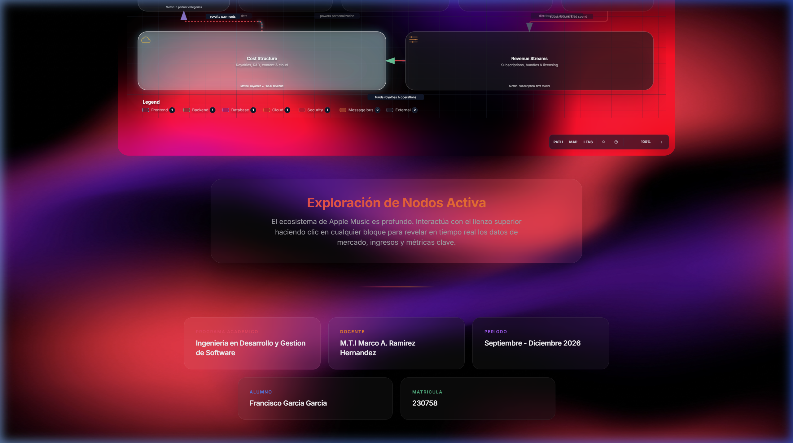
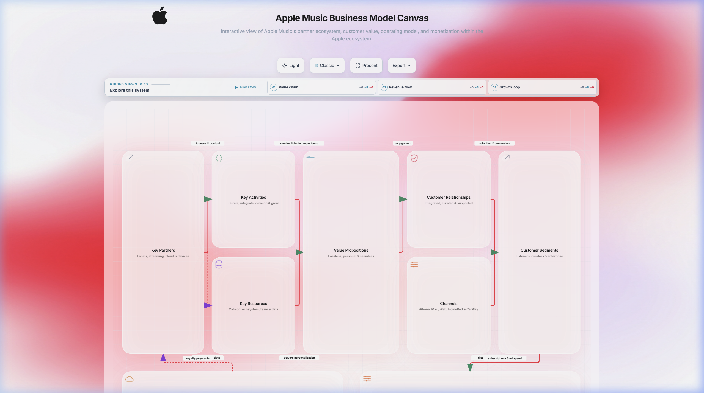
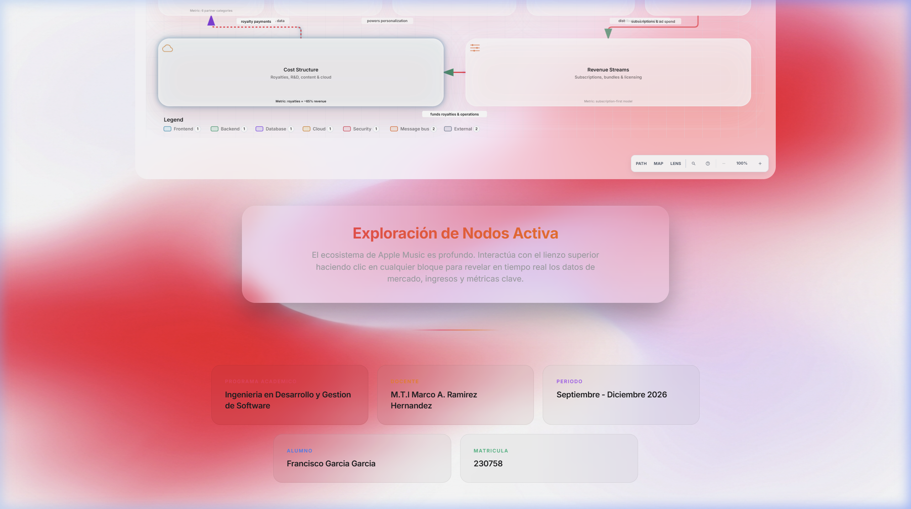
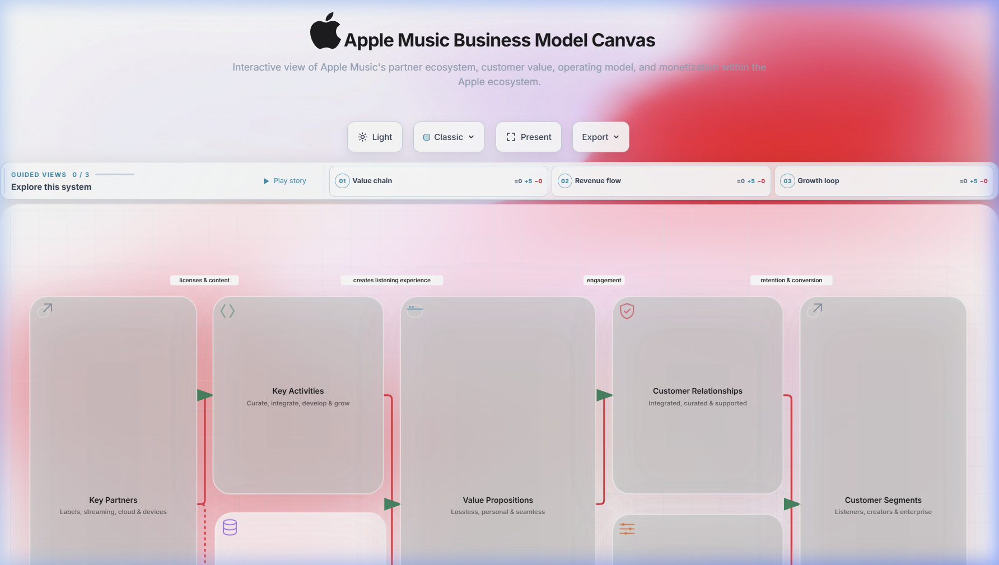
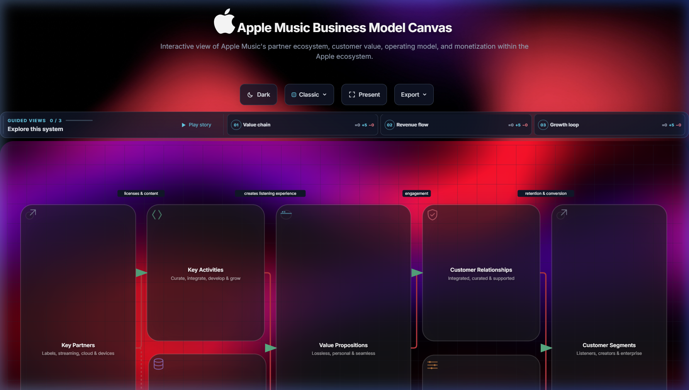
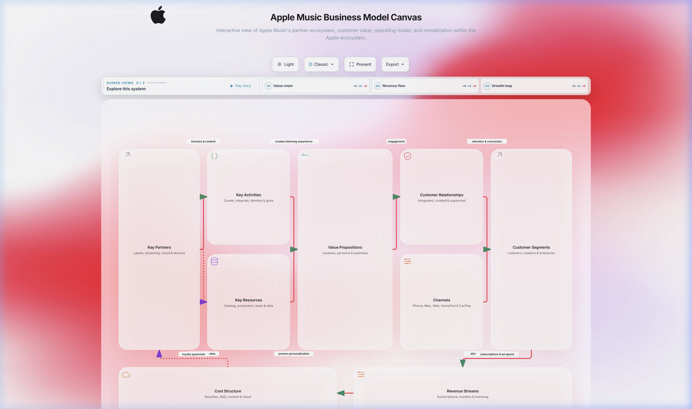
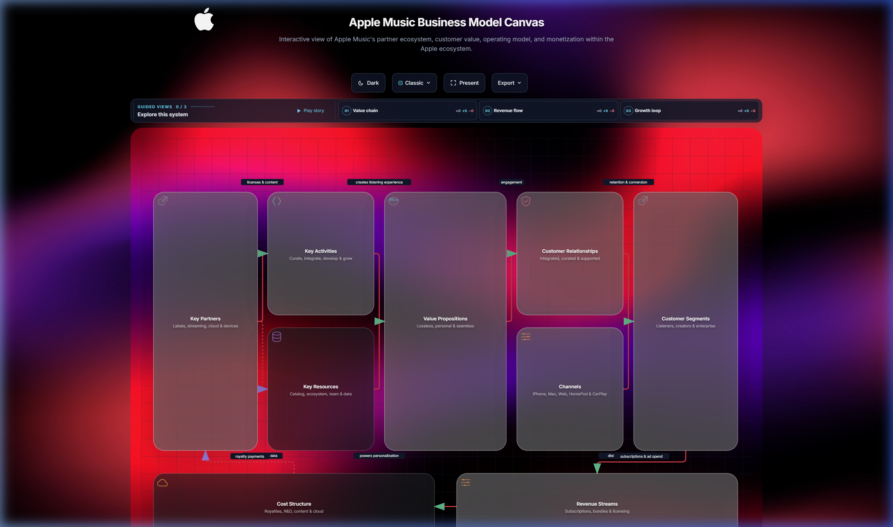

# Practica 03: Business Model Canvas Interactivo — Apple Music

**[Ver el diagrama de modelo canvas interactivo en vivo (GitHub Pages)](https://F-Anks.github.io/Integradora_230758/Practica03/apple-music-business-model-canvas.html)**

---

## Descripcion General

En esta practica se genero un **Business Model Canvas interactivo** utilizando **Archify** (agente de modelado arquitectonico) para la plataforma de streaming **Apple Music**.

El resultado es un diagrama HTML completamente funcional que describe los 9 bloques del modelo de negocio de Apple Music: socios clave, actividades clave, propuesta de valor, segmentos de clientes, recursos clave, canales, relaciones con clientes, estructura de costos y fuentes de ingresos.

El diagrama fue personalizado con un diseno premium inspirado en la estetica de Apple, incluyendo multiples animaciones interactivas y soporte para modo claro/oscuro.

---

## Caracteristicas Implementadas

### Diseno Visual
- **Estetica Liquid Glass**: Fondo con degradados vibrantes rojo-rosa-morado y efecto glassmorphism en los nodos del canvas.
- **Logo de Apple adaptativo**: Blanco en modo oscuro, negro (Space Gray) en modo claro, con transicion suave.
- **Tipografia Inter**: Fuente de Apple aplicada globalmente a todo el texto del diagrama y la interfaz.
- **Soporte dual de tema**: Modo claro y oscuro con cambio instantaneo via botones de la barra de herramientas.

### Animaciones Interactivas
- **Parallax 360**: Los nodos del canvas, las cards academicas y el panel de exploracion repelen el cursor del mouse en todas las direcciones.
- **Slime/Jelly 3D al scroll**: Al hacer scroll, los elementos se deforman elasticamente (estiramiento, compresion e inclinacion 3D) con un rebote suave al detenerse.
- **3D Tilt hover**: Las cards academicas y el panel de exploracion se inclinan en 3D siguiendo la posicion exacta del cursor.
- **Scroll-reveal escalonado**: Las cards academicas y el panel de exploracion aparecen con animacion fade-in desde abajo al hacer scroll.
- **Expansion de nodos**: Al hacer clic en cualquier bloque del canvas, se expande a pantalla completa mostrando informacion detallada con animaciones de entrada.

### Contenido del Canvas
Cada bloque del modelo contiene informacion detallada sobre Apple Music:

| Bloque | Descripcion |
|--------|-------------|
| **Key Partners** | Universal Music, Sony Music, Warner Music, fabricantes de dispositivos |
| **Key Activities** | Desarrollo del ecosistema, licenciamiento, curaduria, integracion con hardware |
| **Key Resources** | Catalogo de 100M+ canciones, ecosistema de 2B+ dispositivos, infraestructura cloud |
| **Value Propositions** | Lossless y Spatial Audio, cero anuncios, integracion perfecta, Apple Music Sing |
| **Customer Relationships** | Ecosistema cerrado, privacidad, curaduria humana, Apple Music Replay |
| **Customer Segments** | Usuarios Apple, audiofilos, familias, estudiantes, suscriptores Apple One |
| **Channels** | iOS, iPadOS, macOS, watchOS, HomePod, CarPlay, Web Player, Android |
| **Cost Structure** | Regalias (~65%), I+D, infraestructura, marketing global |
| **Revenue Streams** | Individual $10.99, Family $16.99, Apple One bundles, sin tier gratuito |

---

## Capturas del Resultado

### Modo Oscuro — Vista Principal

### Modo Oscuro — Cards Academicas (Parte Inferior)

### Modo Claro — Vista Principal

### Modo Claro — Cards Academicas (Parte Inferior)

---

## Pruebas Visuales Automatizadas (Visual Checks)

Archify genero pruebas visuales de contencion para asegurar el renderizado correcto bajo distintos temas y resoluciones:

### Resolucion 1440x900
| Modo Claro | Modo Oscuro |
|:---:|:---:|
|  |  |

### Resolucion Ultra-Ancha (2048x1320)
| Modo Claro | Modo Oscuro |
|:---:|:---:|
|  |  |

---

## Archivos Entregables

| Archivo | Descripcion |
|---------|-------------|
| `apple-music-business-model-canvas.html` | Diagrama principal interactivo con todas las animaciones y personalizaciones |
| `apple-music-business-model-canvas.json` | Estructura base de datos y esquema del diagrama |
| `apple-music-business-model-canvas.visual-check.html` | Reporte visual automatizado generado por Archify |
| `apple-music-business-model-canvas.visual-check.json` | Metadata asociada a las capturas de revision visual |
| `bg_dark.jpg` / `bg_light.jpg` | Fondos personalizados para modo oscuro y claro |
| `images/` | Capturas de pantalla del resultado final |

---

## Datos Academicos

- **Programa:** Ingenieria en Desarrollo y Gestion de Software
- **Docente:** M.T.I Marco A. Ramirez Hernandez
- **Periodo:** Septiembre - Diciembre 2026
- **Alumno:** Francisco Garcia Garcia
- **Matricula:** 230758
